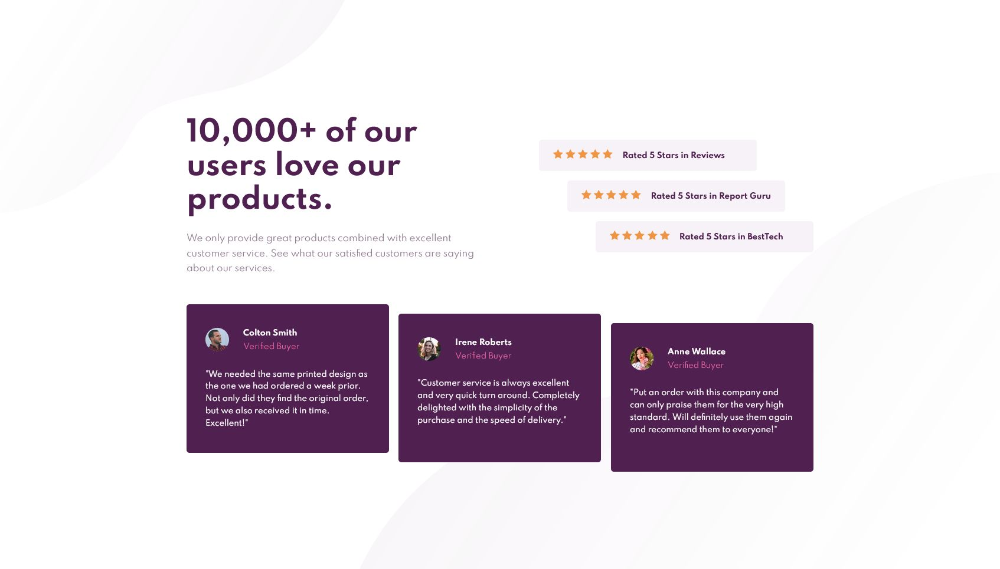
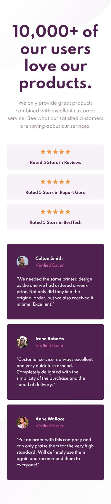

# Frontend Mentor - Social proof solution

This is a solution to the [Social proof challenge on Frontend Mentor](https://www.frontendmentor.io/challenges/social-proof-section-6e0qTv_bA). Frontend Mentor challenges help you improve your coding skills by building realistic projects.

## Table of contents

- [Overview](#overview)
  - [Screenshot](#screenshot)
  - [Links](#links)
- [My process](#my-process)
  - [Built with](#built-with)
  - [What I learned](#what-i-learned)
- [Author](#author)

## Overview

Hi! This is my attempt at the Social proof section.

The layout aspect was relatively straightforward, but getting the "cascade" effect was somewhat challenging while keeping the layouts in mind.

### Screenshot

Desktop

Mobile

### Links

- Solution URL: [Here!](https://github.com/sheronimo/frontendmentor-socialproof)
- Live Site URL: [Here!](https://sheronimo.github.io/frontendmentor-socialproof/)

## My process

1. I worked on styling the components first after having mapped out a rough idea of the layout (which was positioning each component: text, ratings, testimonials, within a grid).
2. Once I tweaked styling and spacing within components to match the design images, I then worked on the layout of the components.
3. I then worked on the cascade effect of the ratings and the testimonials, which would only show up on large screens.
4. Lastly, I worked on the responsive layout on medium and smaller devices.

### Built with

- Semantic HTML5 markup
- SASS
- Flexbox
- Grid
- CSS Transform

### What I learned

I learned further about how to work with grids within grids and flex within grids. I also used CSS transforms in a project for the first time, as opposed to using margins.

## Author

- Github - [sheronimo](https://github.com/sheronimo)
- Frontend Mentor - [@sheronimo](https://www.frontendmentor.io/profile/sheronimo)
